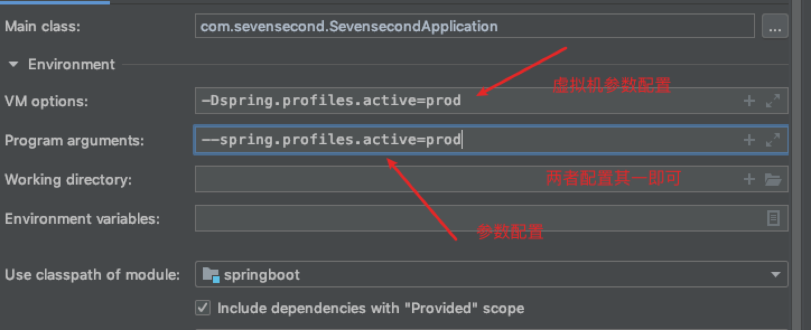

# springboot

### 1.环境配置

- 我们可以使用`yml`的文档块来区分不同的环境，并且使用`spring.profiles.active`来指定文档块来生效
```yaml
server:
  port: 8081

# 那个配置环境激活
spring:
  profiles:
    active: dev
---
# 使用---进行分区
server:
  port: 8082
spring:
  profiles: dev

---
server:
  port: 8083
# 环境的名称
spring:
  profiles: prod

```
#### 1.1 我们可以直接在`application.yml`里面指定激活那个环境

```yaml
spring:
  profiles:
    active: dev
```
#### 1.2 我们也可以在idea里面直接配置参数

